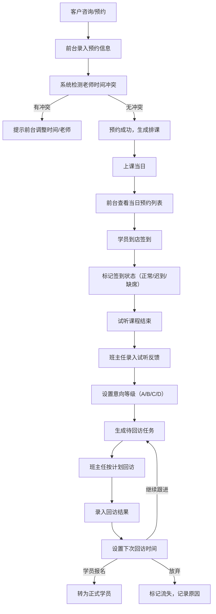

## 1. 产品概述

本系统是专为培训机构设计的桌面客户端管理系统，用于前台和班主任协同管理试听课与到课跟进。系统以当天日历为入口，前台负责接待签到，班主任负责后续转化跟进，实现从试听预约到正式报名的全流程管理。

- **核心问题**：解决培训机构试听排课混乱、学员跟进脱节、转化数据难以统计的痛点
- **目标用户**：培训机构前台接待人员、班主任/课程顾问
- **市场价值**：提升接待效率、规范跟进流程、提高转化率、实现数据化管理

---

## 2. 核心功能

### 2.1 用户角色

| 角色 | 登录方式 | 核心权限 |
|------|----------|----------|
| 前台 | 账号密码登录 | 日历排课、签到接待、学员基础信息录入、查看统计 |
| 班主任 | 账号密码登录 | 学员档案管理、回访记录、转正意向管理、查看统计看板 |

### 2.2 功能模块

1. **日历排课**：月/周/日视图排课、试听预约登记、课程名额查看、老师时间冲突提醒
2. **学员档案**：学员信息管理、家长联系方式整理、试听反馈录入、转正意向分级
3. **签到接待**：到店签到、迟到/缺席标记、当天预约列表、接待状态管理
4. **回访记录**：待回访名单、回访结果模板、下次联系时间提醒、回访历史记录
5. **统计看板**：来源渠道统计、班级满班预警、日报汇总、转化率分析

### 2.3 页面详情

| 页面名称 | 模块名称 | 功能描述 |
|----------|----------|----------|
| 日历排课 | 日历视图 | 支持月/周/日三种视图切换，显示每天的课程安排 |
| 日历排课 | 预约登记 | 录入学员基本信息、选择试听课程、分配老师、自动检测时间冲突 |
| 日历排课 | 名额管理 | 显示各班级剩余名额、满班预警、支持手动调整名额 |
| 日历排课 | 冲突提醒 | 老师同一时段有多个课程时高亮提示、自动阻止重复排课 |
| 学员档案 | 学员列表 | 支持搜索、筛选（意向等级、课程类型、来源渠道） |
| 学员档案 | 详情管理 | 学员基本信息、家长联系方式、试听记录、回访历史、意向等级 |
| 学员档案 | 反馈录入 | 试听表现、家长反馈、课程建议、意向等级调整 |
| 签到接待 | 今日预约 | 显示当天所有预约学员，支持按时间/老师筛选 |
| 签到接待 | 签到操作 | 一键签到、标记迟到/缺席、记录实际到店时间 |
| 签到接待 | 接待状态 | 待接待/接待中/已完成状态流转 |
| 回访记录 | 待回访列表 | 按优先级排序、显示下次联系时间、逾期提醒 |
| 回访记录 | 回访登记 | 选择回访模板、录入沟通内容、设置下次联系时间 |
| 回访记录 | 模板管理 | 常用回访话术模板、支持自定义编辑 |
| 统计看板 | 渠道统计 | 饼图展示各来源渠道占比、趋势分析 |
| 统计看板 | 班级预警 | 各班级报名进度、满班预警标识 |
| 统计看板 | 日报汇总 | 今日预约数、到店数、签到率、转化率等关键指标 |
| 统计看板 | 转化分析 | 意向等级分布、转正漏斗分析 |

---

## 3. 核心流程

**主流程说明**：
1. 客户通过电话/微信/到店咨询，前台在系统中录入预约信息
2. 系统自动检测该老师在该时段是否已有安排，如有冲突则提醒调整
3. 预约成功后，课程显示在日历中，并出现在当日接待列表
4. 上课当天，前台在签到接待模块处理学员签到
5. 试听结束后，班主任录入学员表现反馈和家长意向
6. 系统根据意向等级自动生成回访任务，提醒班主任跟进
7. 班主任按计划回访，记录沟通内容，直到学员报名或放弃

---

## 4. 用户界面设计

### 4.1 设计风格

- **主色调**：深海蓝 `#1e3a5f` - 专业、稳重、值得信赖
- **辅助色**：
  - 成功绿 `#10b981` - 签到完成、高意向
  - 警示橙 `#f59e0b` - 迟到、待跟进、中级预警
  - 危险红 `#ef4444` - 缺席、逾期、紧急预警
  - 信息蓝 `#3b82f6` - 正常状态、信息提示
- **中性色**：
  - 背景：`#f8fafc`（浅灰）
  - 卡片：`#ffffff`（白色）
  - 文字主色：`#1e293b`（深灰）
  - 文字次色：`#64748b`（中灰）
- **按钮风格**：圆角 6px，高度 36px，悬停时轻微上浮阴影
- **字体**：
  - 标题：`PingFang SC` / `Microsoft YaHei`，16px - 20px，半粗体
  - 正文：`PingFang SC` / `Microsoft YaHei`，14px，常规
  - 辅助文字：12px，浅灰色
- **布局风格**：左侧导航 + 右侧内容区，卡片式布局，清晰的信息层级
- **图标**：使用 lucide-react 线性图标，保持简洁统一

### 4.2 页面设计概述

| 页面名称 | 模块名称 | UI 元素 |
|----------|----------|----------|
| 日历排课 | 日历视图 | 顶部切换栏（月/周/日）+ 快捷操作按钮，主体为网格日历，每日课程卡片展示，颜色区分课程类型 |
| 日历排课 | 预约弹窗 | 表单式布局，分步骤引导（学员信息→课程选择→老师分配→确认提交），实时冲突检测提示 |
| 学员档案 | 学员列表 | 顶部搜索筛选栏 + 表格列表，每行展示学员关键信息，支持批量操作 |
| 学员档案 | 详情面板 | 右侧抽屉式面板，标签页切换（基本信息、试听记录、回访历史） |
| 签到接待 | 今日列表 | 时间线式布局，按时间段分组，卡片展示学员信息和签到状态，一键操作按钮 |
| 回访记录 | 待回访列表 | 优先级排序，红色标识逾期任务，卡片展示下次联系时间倒计时 |
| 统计看板 | 数据指标 | 顶部关键指标卡片组，下方图表区（饼图+柱状图+趋势线图），底部班级预警列表 |

### 4.3 响应式

- **设计优先**：桌面端优先设计（1280px 及以上）
- **自适应**：支持 1024px - 1920px 常见分辨率，内容区可滚动
- **触控优化**：按钮最小点击区域 40x40px，适合触控屏操作

### 4.4 交互体验

- **页面切换**：平滑过渡动画（淡入 + 轻微位移）
- **数据加载**：骨架屏占位，避免页面跳动
- **表单反馈**：实时校验，错误提示紧邻输入框
- **操作反馈**：成功/失败 Toast 提示，重要操作二次确认
- **提醒机制**：逾期回访、满班预警等重要信息顶部横幅提醒
