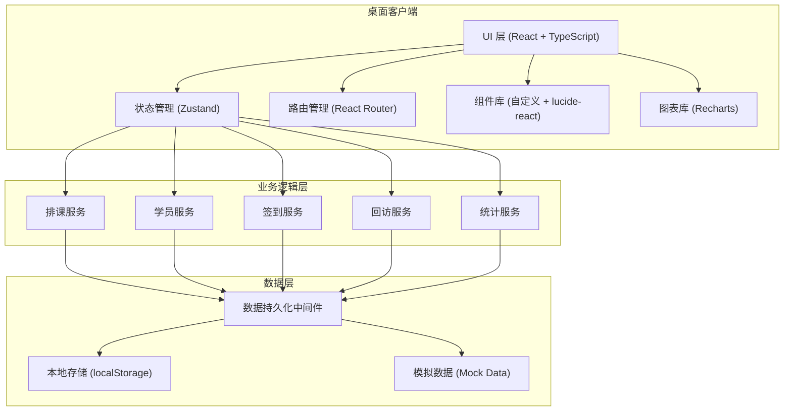

## 1. 架构设计



---

## 2. 技术描述

- **前端框架**：React 18 + TypeScript
- **构建工具**：Vite 5
- **样式方案**：TailwindCSS 3
- **状态管理**：Zustand 4（搭配 persist 中间件实现本地持久化）
- **路由管理**：React Router DOM 6
- **图标库**：lucide-react
- **图表库**：Recharts 2
- **日期处理**：date-fns
- **数据存储**：localStorage（离线可用，后续可扩展为 Electron + SQLite）
- **初始化工具**：vite-init
- **包管理器**：npm（默认，如环境支持 pnpm 则优先使用）

---

## 3. 路由定义

| 路由路径 | 页面名称 | 说明 |
|----------|----------|------|
| `/` | 日历排课（首页） | 默认进入当天日历视图 |
| `/calendar` | 日历排课 | 排课管理、预约登记 |
| `/students` | 学员档案 | 学员列表、详情管理 |
| `/reception` | 签到接待 | 当日签到、接待管理 |
| `/followup` | 回访记录 | 待回访列表、回访登记 |
| `/dashboard` | 统计看板 | 数据统计、预警提醒 |

---

## 4. 数据模型

### 4.1 数据模型定义

```mermaid
erDiagram
    STUDENT ||--o{ SCHEDULE : "预约"
    STUDENT ||--o{ ATTENDANCE : "签到记录"
    STUDENT ||--o{ FEEDBACK : "试听反馈"
    STUDENT ||--o{ FOLLOWUP : "回访记录"
    TEACHER ||--o{ SCHEDULE : "授课"
    COURSE ||--o{ SCHEDULE : "所属课程"
    COURSE ||--o{ CLASS : "开班"
    
    STUDENT {
        string id PK
        string name
        string gender
        int age
        string parentName
        string phone
        string sourceChannel
        string intentionLevel
        string status
        string remark
        datetime createdAt
    }
    
    TEACHER {
        string id PK
        string name
        string subject
        string phone
        boolean active
    }
    
    COURSE {
        string id PK
        string name
        string type
        int duration
        decimal price
        string description
    }
    
    CLASS {
        string id PK
        string courseId FK
        string name
        int maxCapacity
        int currentCount
        string teacherId FK
        string schedule
        date startDate
        date endDate
        string status
    }
    
    SCHEDULE {
        string id PK
        string studentId FK
        string teacherId FK
        string courseId FK
        string classId FK
        date date
        time startTime
        time endTime
        string status
        string remark
        datetime createdAt
    }
    
    ATTENDANCE {
        string id PK
        string scheduleId FK
        string studentId FK
        date date
        time checkinTime
        string status
        string remark
    }
    
    FEEDBACK {
        string id PK
        string scheduleId FK
        string studentId FK
        string teacherId FK
        int rating
        string performance
        string parentFeedback
        string suggestion
        string intentionLevel
        datetime createdAt
    }
    
    FOLLOWUP {
        string id PK
        string studentId FK
        string handlerId
        date nextContactDate
        time nextContactTime
        string priority
        string templateId
        string content
        string result
        date lastContactDate
        string status
        datetime createdAt
        datetime updatedAt
    }
    
    FOLLOWUP_TEMPLATE {
        string id PK
        string name
        string type
        string content
        boolean active
    }
```

### 4.2 核心数据结构（TypeScript 类型定义）

```typescript
// 学员
interface Student {
  id: string;
  name: string;
  gender: 'male' | 'female';
  age: number;
  parentName: string;
  phone: string;
  sourceChannel: string;
  intentionLevel: 'A' | 'B' | 'C' | 'D' | 'none';
  status: 'potential' | 'trial' | 'formal' | 'lost';
  remark: string;
  createdAt: string;
}

// 老师
interface Teacher {
  id: string;
  name: string;
  subject: string;
  phone: string;
  active: boolean;
}

// 课程
interface Course {
  id: string;
  name: string;
  type: 'trial' | 'formal';
  duration: number;
  price: number;
  description: string;
}

// 班级
interface Class {
  id: string;
  courseId: string;
  name: string;
  maxCapacity: number;
  currentCount: number;
  teacherId: string;
  schedule: string;
  startDate: string;
  endDate: string;
  status: 'recruiting' | 'ongoing' | 'finished';
}

// 排课记录
interface Schedule {
  id: string;
  studentId: string;
  teacherId: string;
  courseId: string;
  classId?: string;
  date: string;
  startTime: string;
  endTime: string;
  status: 'scheduled' | 'completed' | 'cancelled';
  remark: string;
  createdAt: string;
}

// 签到记录
interface Attendance {
  id: string;
  scheduleId: string;
  studentId: string;
  date: string;
  checkinTime?: string;
  status: 'pending' | 'checked' | 'late' | 'absent';
  remark: string;
}

// 试听反馈
interface Feedback {
  id: string;
  scheduleId: string;
  studentId: string;
  teacherId: string;
  rating: number;
  performance: string;
  parentFeedback: string;
  suggestion: string;
  intentionLevel: 'A' | 'B' | 'C' | 'D';
  createdAt: string;
}

// 回访记录
interface Followup {
  id: string;
  studentId: string;
  handlerId: string;
  nextContactDate: string;
  nextContactTime: string;
  priority: 'high' | 'medium' | 'low';
  templateId?: string;
  content: string;
  result?: string;
  lastContactDate?: string;
  status: 'pending' | 'completed' | 'cancelled';
  createdAt: string;
  updatedAt: string;
}

// 回访模板
interface FollowupTemplate {
  id: string;
  name: string;
  type: 'first' | 'reminder' | 'promotion' | 'custom';
  content: string;
  active: boolean;
}

// 统计数据
interface DailyReport {
  date: string;
  totalScheduled: number;
  totalChecked: number;
  totalAbsent: number;
  totalLate: number;
  checkinRate: number;
  newStudents: number;
  conversions: number;
  conversionRate: number;
}

interface ChannelStats {
  channel: string;
  count: number;
  percentage: number;
}

interface ClassWarning {
  classId: string;
  className: string;
  currentCount: number;
  maxCapacity: number;
  fillRate: number;
  status: 'normal' | 'warning' | 'full';
}
```

---

## 5. 目录结构

```
src/
├── components/          # 公共组件
│   ├── Layout/         # 布局组件
│   ├── Calendar/       # 日历组件
│   ├── Form/           # 表单组件
│   ├── Table/          # 表格组件
│   ├── Modal/          # 弹窗组件
│   └── Chart/          # 图表组件
├── pages/              # 页面组件
│   ├── Calendar/       # 日历排课
│   ├── Students/       # 学员档案
│   ├── Reception/      # 签到接待
│   ├── Followup/       # 回访记录
│   └── Dashboard/      # 统计看板
├── store/              # 状态管理
│   ├── useStudentStore.ts
│   ├── useScheduleStore.ts
│   ├── useAttendanceStore.ts
│   ├── useFollowupStore.ts
│   └── useDashboardStore.ts
├── types/              # 类型定义
│   └── index.ts
├── utils/              # 工具函数
│   ├── date.ts
│   ├── id.ts
│   └── validation.ts
├── data/               # 模拟数据
│   ├── mockStudents.ts
│   ├── mockTeachers.ts
│   ├── mockCourses.ts
│   ├── mockSchedules.ts
│   └── mockTemplates.ts
├── hooks/              # 自定义 Hooks
│   ├── useCalendar.ts
│   └── useConflictCheck.ts
├── App.tsx
├── main.tsx
└── index.css
```

---

## 6. 状态管理设计

### 6.1 Store 划分原则

- 按业务领域划分 Store，每个 Store 专注于一个核心业务
- 每个 Store 包含：state、actions、computed values
- 使用 Zustand persist 中间件实现本地存储持久化

### 6.2 核心业务逻辑

**排课冲突检测算法**：
- 输入：teacherId, date, startTime, endTime, excludeScheduleId?
- 流程：查询该老师当天所有排课 → 检查时间区间是否重叠 → 返回冲突列表
- 时间重叠判断：(startA < endB) && (endA > startB)

**满班预警计算**：
- 定义阈值：>= 90% 黄色预警，>= 100% 红色预警
- 实时更新：每次排课/签到后重新计算

**回访优先级判定**：
- 高优先级：意向等级 A 且 3 天内未回访
- 中优先级：意向等级 B 且 7 天内未回访
- 低优先级：意向等级 C/D 或 已完成首次回访
